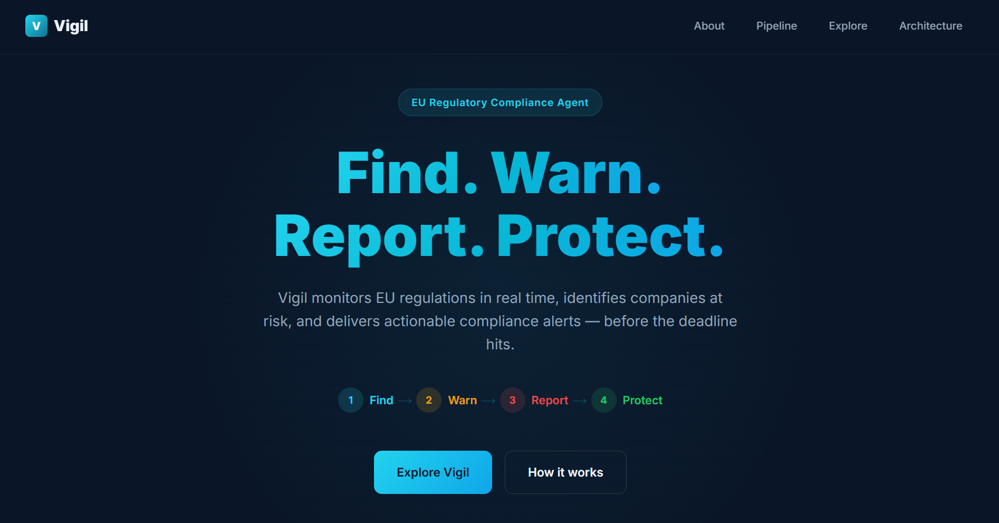
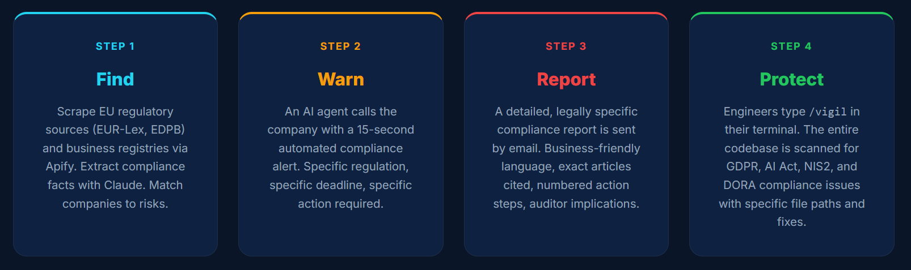
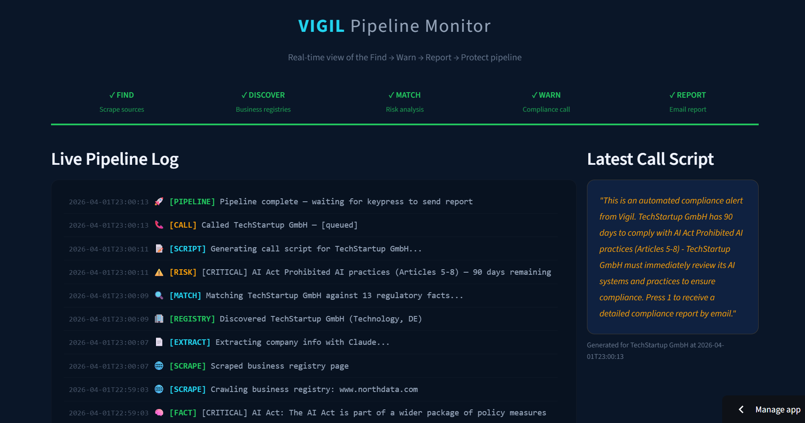
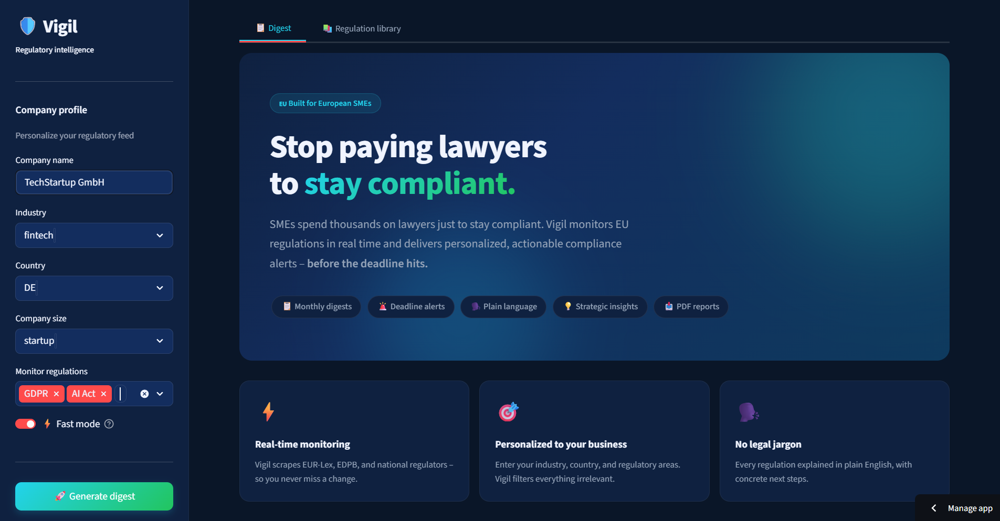
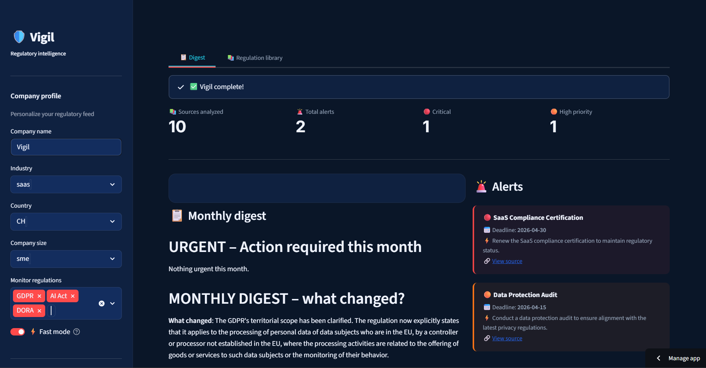
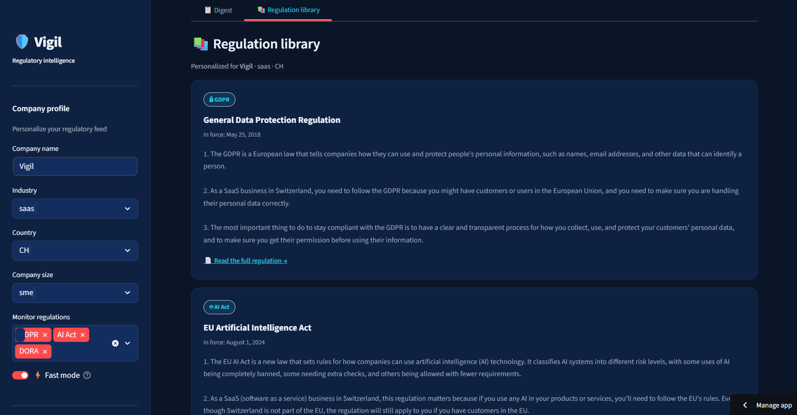
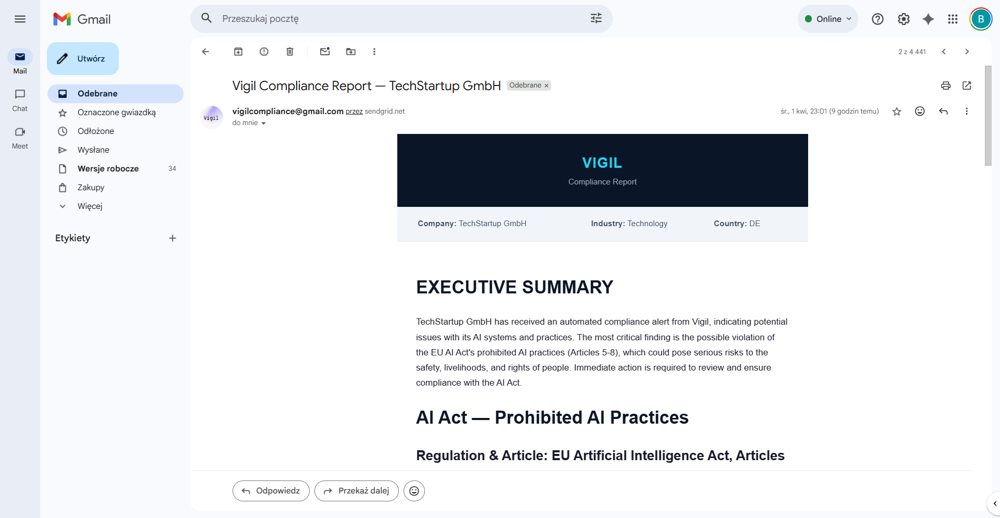
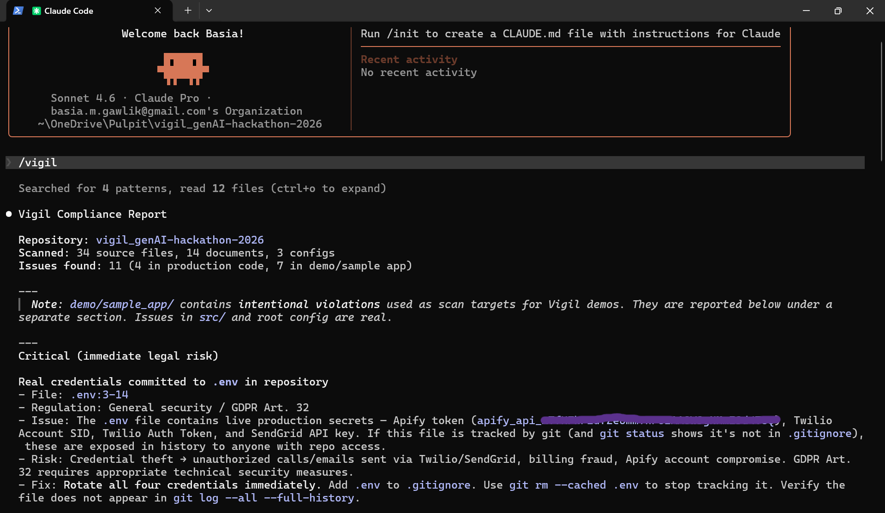
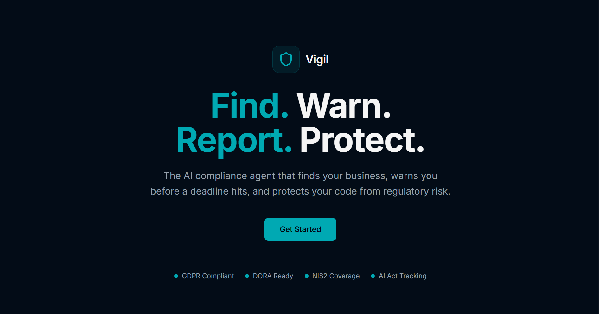

# Vigil — EU Regulatory Compliance Agent

> **Stop paying lawyers to stay compliant.**
> Vigil monitors EU regulations in real time and proactively warns companies before the deadline hits.

Built at **GenAI Zürich Hackathon 2026** · Powered by **Apify** · **Claude** · **Twilio** · **SendGrid**

🔗 **Hub:** [allesgrau.github.io/vigil_genAI-hackathon-2026](Mo)

🔗 **Dashboard:** [vigil-demo.streamlit.app](https://vigil-demo.streamlit.app/)

🔗 **Pipeline Monitor:** [vigil-monitor.streamlit.app](https://vigil-monitor.streamlit.app/)

🔗 **Vigil 2-min Video:** [Google Drive](https://drive.google.com/file/d/1ZMMt4X3khE7k8-oswB_m96rSKZM3gQHp/view?usp=sharing)

🔗 **Full Call Video:** [Google Drive](https://drive.google.com/file/d/15MmlepznvEVHeBbweOicvnCb-bIbzYt7/view?usp=sharing)



> More screenshots at the [bottom of this README](#screenshots).

---

## The Problem

Every year, European companies spend over **€150 billion** on regulatory compliance. Over **55% of EU-based SMEs** say administrative burdens are their single greatest challenge. For many, the first time they hear about a new regulation is when the fine arrives.

Vigil changes that.

---

## What is Vigil?

Vigil is an AI-powered regulatory compliance agent that helps European SMEs track EU regulatory changes relevant to their business — automatically, in plain language, personalized to their industry and country.

It runs an end-to-end pipeline: **Find. Warn. Report. Protect.**

---

## The 4-Step Pipeline



### 1. Find — Scrape & Extract

Apify's `website-content-crawler` scrapes official EU regulatory sources (EUR-Lex, EDPB, national regulators) and business registries to identify affected companies. Claude extracts structured regulatory facts — what's new, what's changing, and what companies need to act on.

### 2. Warn — Automated Phone Call

Vigil generates a personalized compliance alert script with Claude and places an **automated phone call** via Twilio. The recipient hears a 15-second briefing with the regulation, deadline, and required action.

### 3. Report — Compliance Briefing Email

When the recipient presses 1 during the call, Vigil automatically sends a **full compliance report** via SendGrid — generated by Claude with exact legal citations, severity levels, deadlines, numbered action steps, and which regulatory authorities may audit the company.

### 4. Protect — Developer Compliance Scan

Developers install the `/vigil` skill in Claude Code and type `/vigil` in their terminal. Vigil scans the entire codebase for EU regulatory compliance issues (GDPR, AI Act, DORA, NIS2, PSD2, AML) — every finding includes the exact file path, the regulation it violates, and a concrete fix.

Install instructions: [vigil-skill.html](https://allesgrau.github.io/vigil_genAI-hackathon-2026/vigil-skill.html)

---

## Architecture

```
python src/outreach/orchestrator.py

Step 1 — FIND         Apify scrapes EU regulatory sources → Claude extracts facts
Step 2 — DISCOVER     Apify scrapes business registries → Claude extracts company info
Step 3 — MATCH        Claude matches company profile against regulatory risks
Step 4 — WARN         Claude generates call script → Twilio places voice call
Step 5 — REPORT       Recipient presses 1 → Claude generates report → SendGrid sends email
```

### Key Technical Details

- **Fact-based extraction**: Claude extracts discrete regulatory facts (claim, regulation, article, deadline, severity) from scraped documents — not raw chunks
- **Live pipeline**: Zero mocks. Every run scrapes real EU sources, extracts real facts, calls a real phone, sends a real email
- **Pipeline monitor**: SQLite-backed live logging — every pipeline step is written to `pipeline_log` table, displayed in the monitor with 5-second auto-refresh
- **Webhook architecture**: FastAPI server handles Twilio call webhooks (TwiML voice + keypress), triggering the email report on keypress 1

---

## Project Structure

```
vigil_genAI-hackathon-2026/
├── src/
│   ├── scrapers/
│   │   ├── eurlex_scraper.py       # EUR-Lex + EU Commission
│   │   ├── gdpr_scraper.py         # EDPB + national DPA sources
│   │   └── national_scraper.py     # 17 EU country regulators
│   ├── processing/
│   │   ├── chunker.py              # Paragraph-level chunking with overlap
│   │   ├── fact_extractor.py       # Claude fact extraction → structured JSON
│   │   ├── embedder.py             # text-embedding-3-small + fallback
│   │   └── relevance_filter.py     # Hybrid keyword + cosine scoring
│   ├── rag/
│   │   ├── vector_store.py         # In-memory cosine similarity store
│   │   ├── retriever.py            # Two-step retrieval (keyword + semantic)
│   │   └── prompt_templates.py     # All LLM prompts
│   ├── digest/
│   │   ├── digest_generator.py     # Monthly digest + strategic insights
│   │   ├── alert_engine.py         # Alert detection (keyword + LLM)
│   │   └── formatter.py            # JSON + Markdown + PDF output
│   ├── outreach/
│   │   ├── orchestrator.py         # Main pipeline: Find → Warn → Report
│   │   ├── voice_agent.py          # Twilio voice call initiation
│   │   ├── script_generator.py     # Claude generates call scripts
│   │   ├── email_sender.py         # SendGrid compliance report delivery
│   │   └── webhook_server.py       # FastAPI webhooks for Twilio callbacks
│   ├── database/
│   │   └── db.py                   # SQLite: companies, outreach, pipeline logs
│   └── main.py                     # Standalone scrape + digest pipeline
├── app.py                          # Streamlit dashboard (digest, alerts, library)
├── monitor.py                      # Streamlit pipeline monitor (live logs)
├── server.py                       # FastAPI webhook server
├── skill/
│   └── vigil-compliance.md         # /vigil Claude Code skill definition
├── .actor/                         # Apify Actor metadata
├── landing/                        # Landing page + skill installation page
├── docs/                           # GitHub Pages deployment
├── deliverables/
│   ├── screenshots/                # All product screenshots
│   ├── PDFs/                       # Example compliance report PDF
│   └── recordings/                 # Demo video + phone call recording
├── demo/                           # Demo scripts and seed data
├── tests/
│   └── test_vigil.py               # Integration tests (real API calls)
├── Dockerfile
├── requirements.txt
├── requirements-dev.txt
├── .env.example
└── README.md
```

---

## Running the Pipeline

### Prerequisites

- Python 3.12
- [Apify](https://console.apify.com) account + API token
- [Twilio](https://console.twilio.com) account (for voice calls)
- [SendGrid](https://app.sendgrid.com) account (for emails)
- [ngrok](https://ngrok.com) or similar tunnel (for Twilio webhooks)

### 1. Clone and set up environment

```bash
git clone https://github.com/allesgrau/vigil_genAI-hackathon-2026.git
cd vigil_genAI-hackathon-2026

conda create -n vigil python=3.12
conda activate vigil
pip install -r requirements.txt
```

### 2. Configure environment

```bash
cp .env.example .env
```

Edit `.env` with your API keys:

| Variable | Where to get it |
|----------|----------------|
| `APIFY_TOKEN` | [Apify Console](https://console.apify.com/account/integrations) |
| `TWILIO_ACCOUNT_SID` | [Twilio Console](https://console.twilio.com) |
| `TWILIO_AUTH_TOKEN` | [Twilio Console](https://console.twilio.com) |
| `TWILIO_PHONE_NUMBER` | Your Twilio phone number |
| `SENDGRID_API_KEY` | [SendGrid Settings](https://app.sendgrid.com/settings/api_keys) |
| `SENDGRID_FROM_EMAIL` | Your verified SendGrid sender |
| `SERVER_URL` | Your ngrok tunnel URL |

### 3. Start the webhook server

In one terminal:
```bash
conda activate vigil
python server.py
```

In another terminal, expose it with ngrok:
```bash
ngrok http 8000
```

Copy the ngrok URL to `SERVER_URL` in `.env`.

### 4. Run the orchestrator

```bash
conda activate vigil
python src/outreach/orchestrator.py
```

This runs the full live pipeline:
1. Scrapes an EU regulatory source with Apify
2. Scrapes a business registry with Apify
3. Matches the company to regulatory risks with Claude
4. Places an automated phone call via Twilio
5. Sends a compliance report email when the recipient presses 1

> **Production note:** In a production deployment, the orchestrator runs automatically on a **weekly schedule** — no manual intervention required. Each run scrapes the latest regulatory changes, identifies affected companies, and sends proactive compliance alerts.

### 5. Run the pipeline monitor

```bash
conda activate vigil
streamlit run monitor.py --server.port 8502
```

Open http://localhost:8502 to see live pipeline logs.

> **Note:** The [hosted monitor](https://vigil-monitor.streamlit.app/) is connected to the cloud deployment. When running locally, the monitor reads from your local `vigil.db` database — you'll see logs from your own pipeline runs.

### 6. Run the dashboard

```bash
conda activate vigil
streamlit run app.py
```

Open http://localhost:8501.

---

## Scraped Sources

**EU-level:**
- EUR-Lex Official Journal
- EU Commission press corner
- EDPB news
- GDPR.eu
- Regulation-specific pages (DORA, NIS2, AI Act, PSD2, AML)

**Sample national regulators:**

| Country | Sources |
|---------|---------|
| DE | BSI, Bundesanzeiger, BaFin, BfArM |
| PL | UODO, Dziennik Ustaw, KNF |
| FR | CNIL, Légifrance, AMF, ACPR |
| CH | EDÖB, SECO |
| NL | AP, DNB, AFM |
| IT | Garante, Banca d'Italia |
| ES | AEPD, BOE |
| AT | DSB, FMA |
| BE | APD, NBB |
| SE | IMY, FI |
| IE | DPC, Central Bank |

---

## Supported Configuration

**Industries:** fintech, healthcare, ecommerce, saas, manufacturing

**Countries:** DE, PL, FR, CH, NL, IT, ES, AT, BE, SE, IE, LU, DK, FI, PT, CZ, HU, RO

**Regulations:** GDPR, AI Act, PSD2, AML, NIS2, DORA

---

## Running Tests

Tests make real API calls with minimal data. Expected cost: ~$0.05 per run.

```bash
pip install -r requirements-dev.txt
pytest tests/test_vigil.py -v
```

---

## Tech Stack

| Component | Technology |
|-----------|-----------|
| Web scraping | Apify `website-content-crawler` |
| LLM | Claude 3 Haiku (via OpenRouter on Apify) |
| Embeddings | `text-embedding-3-small` (via OpenRouter) |
| Voice calls | Twilio Programmable Voice |
| Email delivery | SendGrid |
| Webhooks | FastAPI + ngrok |
| Dashboard | Streamlit |
| Database | SQLite |
| Codebase scanning | Claude Code skill (`/vigil`) |
| Hosting | Streamlit Cloud + GitHub Pages |

---

## Screenshots

### Pipeline Monitor — Live Logs


### Dashboard — Home page


### Dashboard — Digest


### Regulation Library


### Compliance Report — Email


> Full example compliance report (PDF): [`deliverables/PDFs/vigil_mail_printed.pdf`](deliverables/PDFs/vigil_mail_printed.pdf)

### /vigil Skill — Codebase Scan in Claude Code


### Landing Page


---

## Disclaimer

Vigil is a regulatory intelligence tool, not legal advice. Always consult a qualified legal professional for compliance decisions.

---

*Built with sleep deprivation and determination at GenAI Zürich Hackathon 2026*
