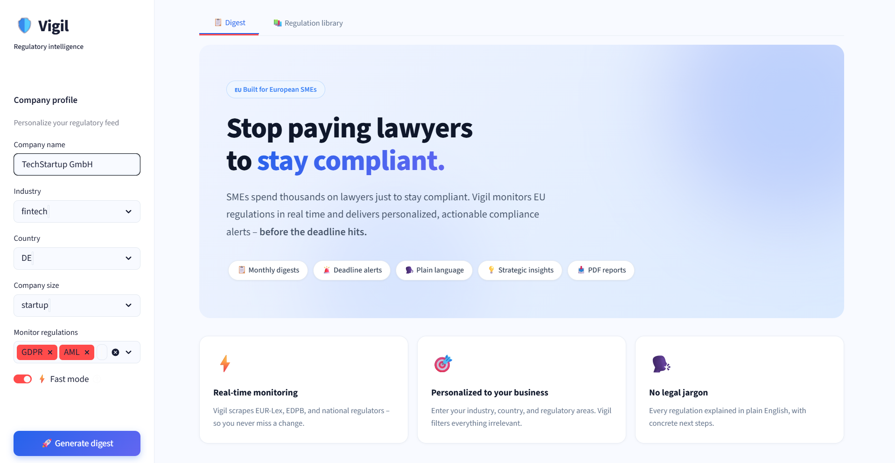
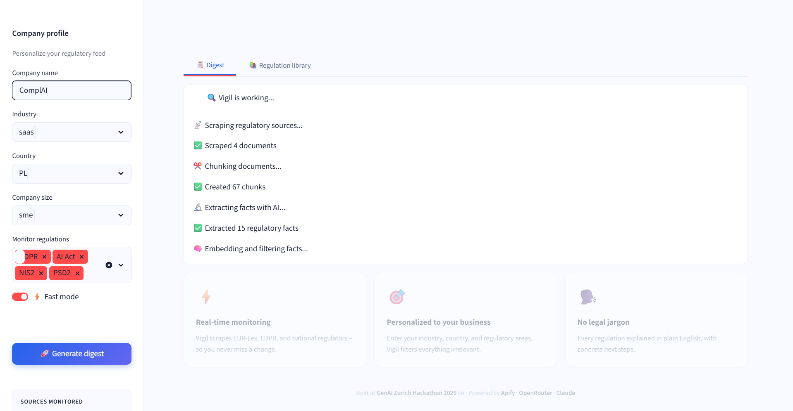
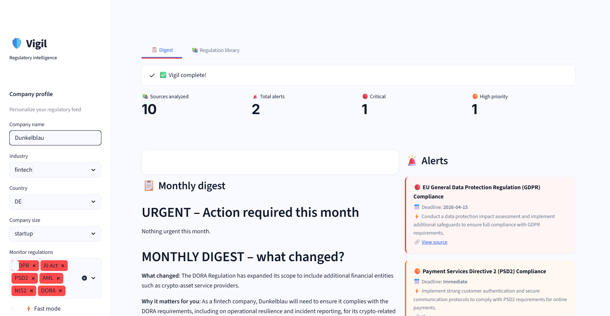
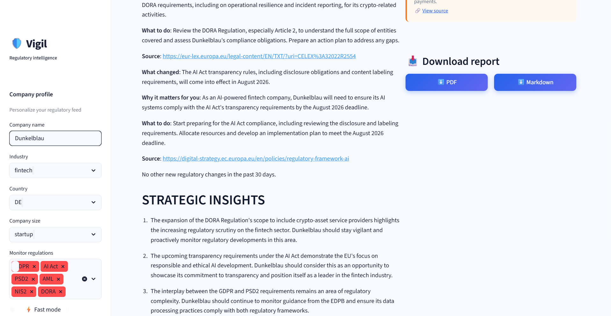
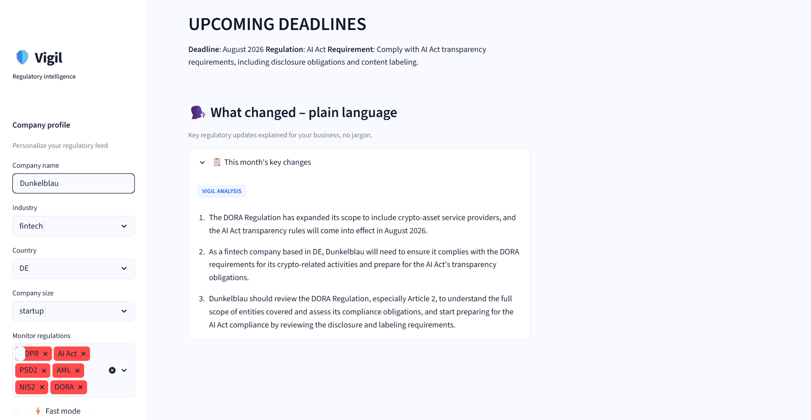
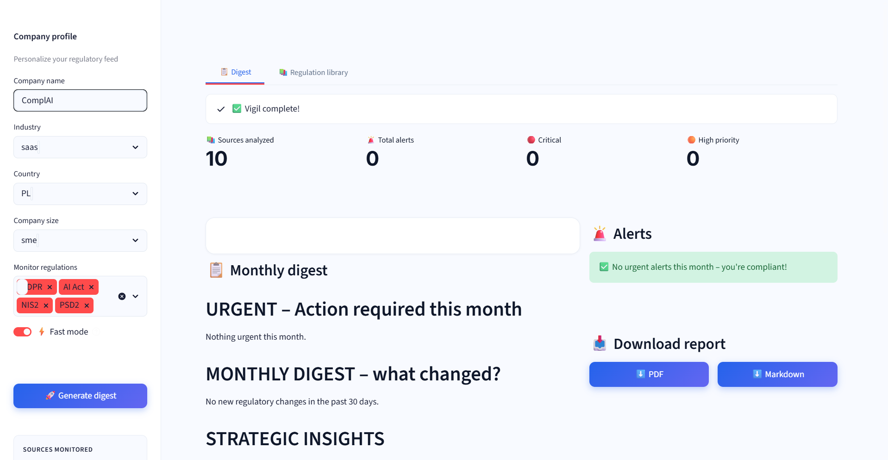
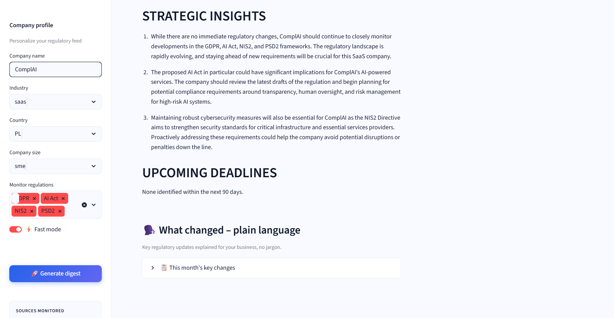
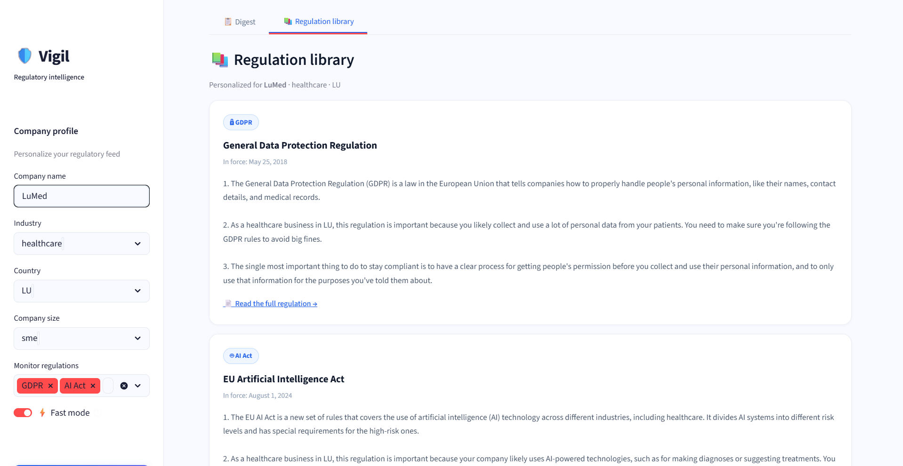

# 🛡️ Vigil – EU Regulatory Intelligence for SMEs

> **Stop paying lawyers to stay compliant.**
> Vigil monitors EU regulations in real time and delivers personalized, actionable compliance alerts – before the deadline hits.

Built at **GenAI Zürich Hackathon 2026** · Powered by **Apify** · **OpenRouter** · **Claude**

---

## What is Vigil?

Vigil is an AI-powered regulatory intelligence tool that helps European SMEs track EU regulatory changes relevant to their business – automatically, in plain language, personalized to their industry and country.

Given a company profile (name, industry, country, regulations of interest), Vigil:

1. **Scrapes** EUR-Lex, EDPB, GDPR, and 17 national regulatory sources in parallel using Apify's `website-content-crawler`
2. **Chunks** documents and **extracts structured facts** via LLM (`Claude 3 Haiku` via OpenRouter)
3. **Embeds** facts using `text-embedding-3-small` for semantic search
4. **Filters and retrieves** relevant facts using a two-step hybrid approach: keyword scoring + cosine similarity vector store
5. **Generates** a personalized monthly digest, deadline alerts, strategic insights, and plain-language summaries
6. **Exports** the full report as PDF or Markdown

---

## Screenshots

### Landing page


### Running pipeline


### Monthly digest – full run




### Monthly digest – fast mode



### Regulation library


---

## Architecture

```
raw_documents (Apify scraping)
    ↓
chunk_documents()         # paragraph-level chunking with overlap
    ↓
extract_facts()           # LLM extracts structured JSON facts per chunk batch
    ↓
embed_facts()             # text-embedding-3-small via OpenRouter
    ↓
filter_relevant()         # hybrid: keyword scoring + severity boost
    ↓
retrieve()                # cosine similarity vector store (in-memory)
    ↓
generate_digest()         # LLM generates monthly digest + plain language summary
generate_alerts()         # keyword detection + LLM-based alert extraction
    ↓
format_output()           # structured JSON → Apify dataset + Markdown/PDF report
```

### Key technical decisions

- **Fact-based embeddings** instead of chunk-based: LLM extracts discrete regulatory facts (claim, regulation, article, deadline, action_required, severity) before embedding. This improves retrieval precision significantly.
- **Two-step retrieval**: keyword pre-filtering with industry/country/regulation-specific keywords, then cosine similarity on the filtered subset.
- **30-day recency window**: prompts instruct LLM to only report changes from the last 30 days, filtering out historical regulatory background.
- **Parallel scraping**: all three scrapers (EUR-Lex, GDPR, national) run via `asyncio.gather` for 3x speed improvement.

---

## Project structure

```
vigil_genAI-hackathon-2026/
├── .actor/
│   ├── actor.json                  # Apify Actor metadata
│   └── input_schema.json           # Actor input schema
├── src/
│   ├── scrapers/
│   │   ├── eurlex_scraper.py       # EUR-Lex + EU Commission news
│   │   ├── gdpr_scraper.py         # EDPB + national DPA sources
│   │   └── national_scraper.py     # 17 EU country regulators
│   ├── processing/
│   │   ├── chunker.py              # Paragraph-level chunking with overlap
│   │   ├── fact_extractor.py       # LLM fact extraction to structured JSON
│   │   ├── embedder.py             # OpenRouter embeddings + fallback
│   │   └── relevance_filter.py     # Hybrid keyword + cosine scoring
│   ├── rag/
│   │   ├── vector_store.py         # In-memory cosine similarity store
│   │   ├── retriever.py            # Two-step retrieval
│   │   └── prompt_templates.py     # All LLM prompts with recency constraints
│   ├── digest/
│   │   ├── digest_generator.py     # Monthly digest + plain language summary
│   │   ├── alert_engine.py         # Keyword + LLM alert detection
│   │   └── formatter.py            # JSON + Markdown + PDF output
│   └── main.py                     # Apify Actor entrypoint
├── app.py                          # Streamlit frontend
├── tests/
│   └── test_vigil.py               # 22 integration tests (real API calls)
├── demo/                           # Screenshots and example reports
├── .streamlit/                     # For cloud Streamlit deployment
├── Dockerfile
├── requirements.txt                # Production dependencies
├── requirements-dev.txt            # Dev + test dependencies
├── vigil_onepager.html
├── README.md
├── .gitignore
└── .env.example
```

---

## Setup

### Prerequisites

- Python 3.12
- [Apify account](https://console.apify.com) with API token
- [Apify CLI](https://docs.apify.com/cli) (for Actor deployment)

### 1. Clone and create environment

```bash
git clone https://github.com/allesgrau/vigil_genAI-hackathon-2026.git
cd vigil_genAI-hackathon-2026

conda create -n vigil python=3.12
conda activate vigil
```

### 2. Install dependencies

```bash
# Production only (for Apify Actor)
pip install -r requirements.txt

# Development + Streamlit + tests
pip install -r requirements-dev.txt
```

### 3. Configure environment

```bash
cp .env.example .env
```

Edit `.env`:
```bash
APIFY_TOKEN=your_apify_token_here
OPENROUTER_ACTOR_URL=https://openrouter.apify.actor/api/v1
```

Get your Apify token at: https://console.apify.com/account/integrations

### 4. Run the Streamlit frontend

```bash
streamlit run app.py
```

Open http://localhost:8501

### 5. Run the Apify Actor locally

```bash
python src/main.py
```

---

## Running tests

Tests make real API calls (Apify + OpenRouter) with minimal data – same philosophy as `test_mode`. Expected cost: ~$0.05 per full run.

```bash
pytest tests/test_vigil.py -v
```

Test coverage: chunker, fact extractor, embedder, relevance filter, digest generator (including no-past-deadlines assertion), formatter.

---

## Deploying to Apify

```bash
apify push
```

Then publish the Actor from https://console.apify.com/actors

**Actor input schema:**

```json
{
  "company_name": "TechStartup GmbH",
  "industry": "fintech",
  "country": "DE",
  "size": "startup",
  "areas_of_concern": ["GDPR", "AI Act", "DORA"],
  "test_mode": true
}
```

Supported industries: `fintech`, `healthcare`, `ecommerce`, `saas`, `manufacturing`

Supported countries: DE, PL, FR, CH, NL, IT, ES, AT, BE, SE, IE, LU, DK, FI, PT, CZ, HU, RO

Supported regulations: `GDPR`, `AI Act`, `PSD2`, `AML`, `NIS2`, `DORA`

**`test_mode: true`** – scrapes 2 URLs, max 3 pages per source (~$0.10/run)

**`test_mode: false`** – full scraping, 15 pages per source, supports link depth = 1 (~$10/run)

---

## Scraped sources

**EU-level:**
- EUR-Lex Official Journal (`eur-lex.europa.eu/oj/direct-access.html`)
- EU Commission press corner
- EDPB news (`edpb.europa.eu/news/news_en`)
- GDPR.eu news
- Regulation-specific pages (DORA, NIS2, AI Act, PSD2, AML)

**National regulators (17 countries):**

| Country | Sources |
|---------|---------|
| DE | BSI, Bundesanzeiger, BaFin (fintech), BfArM (healthcare) |
| PL | UODO, Dziennik Ustaw, Legislacja, KNF (fintech) |
| FR | CNIL, Légifrance, AMF, ACPR (fintech) |
| CH | EDÖB, SECO, Admin.ch |
| NL | AP, DNB, AFM (fintech) |
| IT | Garante, Banca d'Italia |
| ES | AEPD, BOE |
| AT | DSB, FMA |
| BE | APD, NBB |
| SE | IMY, FI |
| IE | DPC, Central Bank (fintech) |
| LU | CNPD |
| DK | Datatilsynet |
| FI | Tietosuoja |
| PT | CNPD |
| CZ | ÚOOÚ |
| HU | NAIH |
| RO | ANSPDCP |

---

## Output format

Vigil outputs a structured JSON object saved to the Apify dataset:

```json
{
  "generated_at": "2026-03-16T11:01:00Z",
  "company_name": "Dunkelblau",
  "industry": "fintech",
  "country": "DE",
  "sources_analyzed": 10,
  "alerts_count": 2,
  "critical_alerts": [...],
  "high_alerts": [...],
  "medium_alerts": [...],
  "digest_markdown": "...",
  "plain_summaries": [...],
  "full_report_markdown": "...",
  "status": "success",
  "vigil_version": "0.1.0"
}
```

---

## Disclaimer

Vigil is a regulatory intelligence tool, not legal advice. Always consult a qualified legal professional for compliance decisions.

---

*Built at GenAI Zürich Hackathon 2026 🇨🇭*
